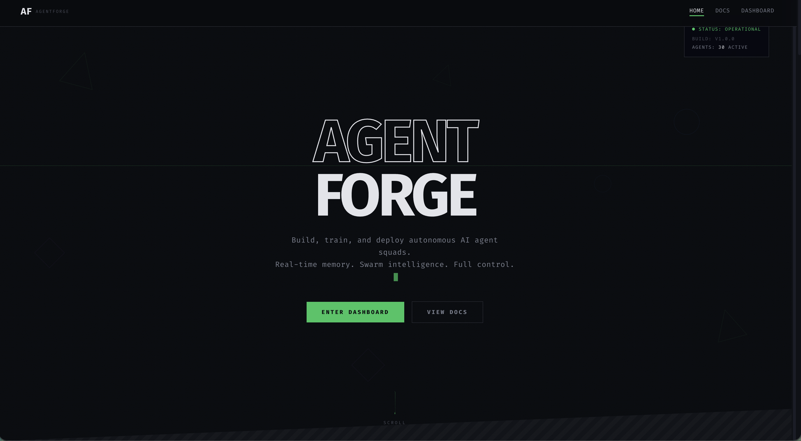

# AgentForge

An in-browser AI agent orchestration dashboard with a real working memory engine. Build, simulate, and inspect multi-agent swarms — no backend required.



## What It Does

AgentForge is a browser-based platform for designing and testing AI agent systems. Everything runs client-side: the memory engine, vector search, swarm simulation, and service integrations. No backend required.

**The memory engine is real.** It implements TF-IDF vectorization, HNSW approximate nearest-neighbor search, temporal decay scoring, and pattern learning — all in pure TypeScript with IndexedDB persistence. Store a memory, search for it semantically, and watch it decay over time.

**The swarm simulator is real.** 15 agents across 4 phases (discovery, analysis, synthesis, optimization) execute against the memory engine, storing and searching entries as they work. Watch them activate, complete tasks, and advance through phases in real time.

## Dashboard Panels

| Panel | Purpose |
|---|---|
| **Squad Builder** | Visual graph editor (React Flow) for agent topology. Load a 15-agent V3 swarm template and run the simulation — nodes update live as agents change status. |
| **Memory Inspector** | Three-tier memory viewer (hot/warm/cold) with real-time tier breakdown from the engine. Entries promote and demote based on access patterns and temporal decay. |
| **Training Studio** | Training metrics visualization with Recharts. Tracks loss curves, accuracy, and training progression. |
| **Vector Galaxy** | 3D vector space visualization (Three.js). Projects memory entry vectors into a navigable 3D point cloud. |
| **Live Feed** | Real-time event stream from the engine event bus. Displays store, search, swarm, and integration events as they happen. Toggle mock events on/off. |
| **Integration Hub** | Service management for 8 adapters (Ollama, HuggingFace, Claude-Flow, OpenClaw, AgentDB, Anthropic, OpenAI, Custom REST). Connect, configure, and monitor health. Includes a TEST DATA workbench for storing/searching/seeding memory entries. |
| **Command Center** | Interactive terminal with 16 registered actions for memory operations, swarm control, database management, and utilities. |

## Memory Engine Architecture

```
Content → TF-IDF Vectorizer → Sparse Vector → HNSW Index
                                                  ↓
Search Query → TF-IDF → Cosine Similarity ← HNSW Neighbors
                              ↓
                    Weighted Score = 0.5×similarity + 0.3×temporalDecay + 0.2×patternBoost
                              ↓
                       Ranked Results
```

- **TF-IDF Vector Store** — Term frequency-inverse document frequency with cosine similarity. No external ML models.
- **HNSW Index** — Hierarchical Navigable Small World graph for approximate nearest-neighbor search. Configurable layers, beam width, and connection limits.
- **Temporal Decay** — Entries decay based on configurable half-lives per tier. Hot entries decay in minutes, cold entries in hours. Tier promotion/demotion happens automatically.
- **Pattern Tracker** — Repeated search patterns boost matching entries. Co-occurrence tracking identifies related memories.
- **IndexedDB Persistence** — All state persists across page reloads via debounced writes to IndexedDB.

## Swarm Simulation

The swarm simulator runs 15 agents through 4 phases:

| Phase | Agents | What They Do |
|---|---|---|
| **Discovery** | 4 scouts | Store new observations and patterns into memory |
| **Analysis** | 4 specialists | Search memory for patterns and correlations |
| **Synthesis** | 4 workers | Combine findings and store synthesized knowledge |
| **Optimization** | 2 guardians + 1 coordinator | Validate, optimize, and coordinate final output |

Each agent operates on the real memory engine — scouts `store()` entries, specialists `search()` for patterns. Events propagate through the event bus to the Live Feed and Memory Inspector in real time.

## Tech Stack

- **React 19** + **TypeScript 5.9** — `verbatimModuleSyntax`, `erasableSyntaxOnly`
- **Vite 7** — Dev server with proxy routes for service adapters
- **Tailwind 4** — "Tactical Terminal" dark brutalist mono theme
- **React Flow** — Agent topology graph editor
- **Three.js** (via React Three Fiber) — 3D vector visualization
- **Recharts** — Training metrics charts
- **Framer Motion** — Animations
- **IndexedDB** — Client-side persistence (no backend)

## Getting Started

```bash
git clone https://github.com/QRcode1337/AgentForge.git
cd AgentForge
npm install
npm run dev
```

Open `http://localhost:3001/#/dashboard` to enter the dashboard.

### Service Integrations

The adapters probe real services through Vite dev server proxies. To connect:

- **Ollama** — Run Ollama locally on port 11434
- **Anthropic / OpenAI** — Configure API keys via the CONFIGURE modal on each card
- **HuggingFace** — Works without auth for public model metadata
- **AgentDB** — Always connected (uses IndexedDB)
- **Custom REST** — Point at any HTTP endpoint

## Project Structure

```
src/
├── engine/              # Memory engine core
│   ├── memory-engine.ts # CRUD + search orchestration
│   ├── vector-store.ts  # TF-IDF vectorizer
│   ├── hnsw-index.ts    # HNSW approximate NN
│   ├── temporal-decay.ts# Tier decay scoring
│   ├── pattern-tracker.ts# Pattern learning
│   ├── event-bus.ts     # Pub/sub event system
│   ├── persistence.ts   # IndexedDB state manager
│   ├── swarm-simulator.ts# 15-agent 4-phase sim
│   ├── seed-data.ts     # 25 seed entries
│   └── adapters/        # Service probe adapters
├── components/          # 7 dashboard panels
├── hooks/               # React hooks (useMemory, useSwarm, useIntegrations)
├── pages/               # Home, Docs, Dashboard
└── types/               # Shared TypeScript types
```

## License

MIT
