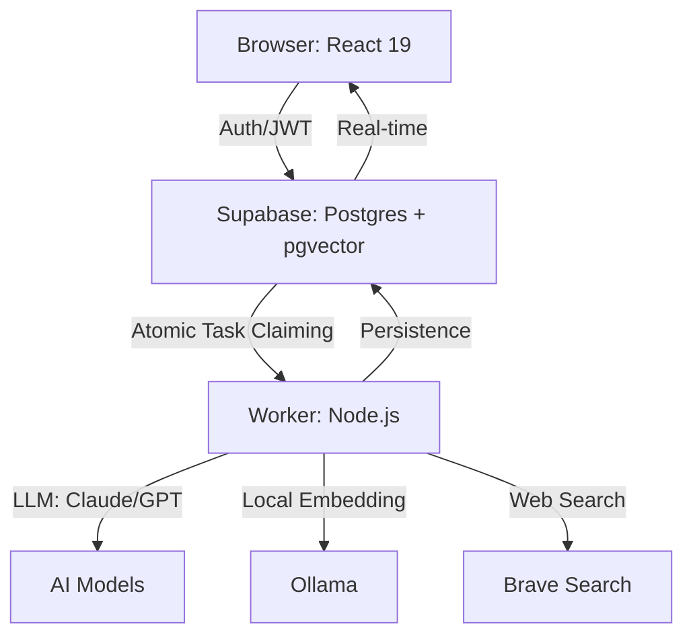

# AgentForge Use Cases

Most people who download AgentForge will open it, see a dark dashboard, click around for two minutes, and close it. They'll think "cool UI" and never come back.

That's a waste. This document exists to show you what you're actually sitting on top of.

AgentForge is not a chatbot wrapper. It's not a LangChain GUI. It's an **orchestration platform** where multiple AI agents work together on a shared task, pass information through a vector memory layer, and report results in real-time while you watch. Every panel in the dashboard is a window into a different part of that pipeline.

Here's what you can actually do with it.

---

## 1. Run a Research Swarm That Thinks Across Agents

This is the headline feature, and most people will miss it entirely because they won't realize the agents are talking to each other through memory.

### What's really happening

When you launch a research swarm, you're not just running four Claude calls in sequence. You're running a **phased intelligence pipeline** where:

- **Phase 1 (Discovery):** Two scout agents search the web in parallel. Each scout has a different angle — one focuses on capabilities and trends, the other on trade-offs and criticism. They independently store their best findings into shared vector memory under the `research` namespace.

- **Phase 2 (Analysis):** An analyst agent wakes up, searches that same memory, and looks for patterns, contradictions, and gaps across both scouts' work. It stores structured insights under the `analysis` namespace.

- **Phase 3 (Synthesis):** A coordinator agent searches both `research` and `analysis` namespaces, synthesizes everything into an executive briefing with recommendations and risk assessment, and stores the final report under `reports`.

The key insight: **agents don't pass JSON to each other.** They read and write to the same vector database. Agent-2 doesn't know what Agent-1 said — it searches memory semantically and builds on whatever is relevant. This means the pipeline is robust to individual agent failures. If Scout-1 finds nothing useful, the analyst still has Scout-2's data.

### What this looks like in practice

You type a topic. Four tasks hit the queue. Your worker picks them up one by one (discovery tasks first, since they're queued first). As each agent runs, you can watch the events stream into the **Live Feed** panel. You'll see tool calls (`web_search`, `memory_store`), decisions, and completions. Within 2-3 minutes, the coordinator drops a multi-section report into memory.

The report isn't a summary of the other agents' outputs. It's a synthesis. The coordinator reads raw research findings and structured analysis, then produces something neither could have produced alone.

### Scenarios this is built for

- **Competitive landscape analysis:** "AI agent frameworks in 2026: LangGraph vs CrewAI vs AutoGen vs custom" — scouts find current capabilities and developer complaints, analyst identifies which framework wins for which use case, coordinator produces a recommendation.
- **Technical due diligence:** "Should we adopt Postgres + pgvector or go with a dedicated vector DB like Pinecone?" — scouts gather benchmarks and production war stories, analyst maps the trade-offs to your specific requirements, coordinator gives a go/no-go.
- **Market research:** "What are enterprise customers actually paying for AI coding assistants?" — scouts find pricing data and analyst reports, analyst identifies pricing models and segments, coordinator produces a market overview.
- **Literature review:** "Current state of RLHF alternatives: DPO, KTO, IPO" — scouts gather paper summaries and benchmark results, analyst compares approaches, coordinator writes a research brief.

### How to launch one

```bash
# Default topic
npx tsx server/run-swarm.ts

# Custom topic
npx tsx server/run-swarm.ts "WebAssembly in production: who is using it and for what"

# Watch it execute
npx tsx server/worker-status.ts
```

Or from the dashboard: open **Command Center**, type `swarm:start`. Watch events flow in through **Live Feed**. When it finishes, open **Memory Inspector** to browse the findings.

### What you might not realize

- You can run multiple swarms. Each gets its own `swarm_run_id`. Previous results stay in memory.
- Memories persist across swarms. Your second research swarm can search findings from your first one.
- You can edit `server/run-swarm.ts` to change the agent count, phases, tools, and system prompts. The 4-agent template is a starting point, not a limit.
- Each agent can use different tools. Scouts get `web_search` + `memory_store`. The analyst gets `memory_search` + `memory_store`. You could add `code_interpreter`, custom API tools, or anything your worker supports.

---

## 2. Build a Persistent Knowledge Base That Agents Can Search

This is the part most people treat as a database table. It's not. It's a **vector memory system with tiered lifecycle management**.

### Why this matters

Every agent interaction produces information. Without persistent memory, that information dies when the conversation ends. With AgentForge's memory layer, agents can:

- Store facts they've learned and retrieve them weeks later
- Build on each other's findings across separate sessions
- Search semantically — not just by keyword, but by meaning

### How the memory pipeline actually works

1. Agent (or you) stores text
   - Row inserted into `memories` table
   - Content: the text
   - Namespace: logical grouping
   - Status: "pending"
2. Worker embedder loop (runs every 5 seconds)
   - Finds rows where embedding_status = "pending"
   - Calls Ollama (qwen3-embedding:4b, 1536 dims)
   - Updates row: embedding vector added, status = "ready"
3. Now searchable by semantic similarity
   - RPC: search_memories(query_embedding, match_threshold, match_count)

The embedding happens **asynchronously**. You don't wait for it. The memory is immediately available for exact-match queries; semantic search activates once the vector is filled (usually within seconds).

### The three tiers aren't cosmetic

Memories live in three tiers based on access patterns:

| Tier | What lives here | What it means |
| :--- | :--- | :--- |
| **Hot** | Frequently accessed | Active working memory. The stuff agents are using right now. |
| **Warm** | Moderate access | Background knowledge. Still relevant but not in active use. |
| **Cold** | Rarely accessed | Archive. Candidates for cleanup or compression. |

This isn't just a label. The Memory Inspector panel shows you the distribution. When your hot tier is overloaded and your cold tier is empty, your agents are thrashing on too much context. When everything is cold, your agents aren't using their memory.

### What you can actually do with this

**Build a living research library:**

Run multiple research swarms on related topics. Each swarm's findings stay in memory. Over time, you build a searchable knowledge base that future agents can query. The third swarm on "AI agents" benefits from the first two's findings.

**Store your own knowledge:**

From the Command Center terminal:

```bash
mem:store --ns notes --content "Our API rate limit is 1000 req/min per key, resets at midnight UTC"
mem:store --ns decisions --content "We chose Postgres over DynamoDB because of pgvector"
mem:store --ns patterns --content "Check that Ollama is running on port 11434"
```

Now any agent with `memory_search` can find these. When an agent is debugging an embedding failure, it can search memory and find your note about Ollama.

**Audit what agents know:**

```bash
mem:namespaces          # See all logical groupings
mem:tiers               # See hot/warm/cold distribution
mem:search "database"   # Find everything agents know about databases
```

**Clean up stale knowledge:**

```bash
mem:purge-cold          # Remove all cold-tier entries
mem:delete --id <id>    # Remove a specific entry
```

### What you might not realize

- Embeddings run locally through Ollama. No data leaves your machine for the embedding step. You're not paying OpenAI per embedding.
- The `content_hash` field prevents exact duplicates. If two agents try to store the same text, only one copy exists.
- Memories have a `visibility` field: `private` (only your agents) or `shared` (cross-user). This is the foundation for multi-user agent collaboration.
- The `ttl_seconds` field lets you create self-expiring memories.
- You can search by namespace. `mem:search --ns research "agent frameworks"` only searches within research findings.

---

## 3. Design Custom Agent Teams on a Visual Canvas

The Squad Builder isn't a diagram tool. It's a live topology editor that maps directly to the agents in your database.

### What the canvas actually represents

Each node on the canvas is a real agent record in Supabase. When you create an agent through the Agent Editor, it gets a row in the `agents` table with:

- **Name:** What it's called in the UI and in event logs
- **Role:** Determines its position in the swarm hierarchy (scout, worker, coordinator, specialist, guardian)
- **System prompt:** The personality and instructions
- **Model:** Which LLM it uses (Claude Sonnet 4.5, etc.)
- **Tools:** What capabilities it has (`web_search`, `memory_store`, `memory_search`, `code_interpreter`)

### The five roles and when to use each

- **Scout** — First contact. Give them `web_search` and `memory_store`.
- **Specialist** — Deep expertise. Give them `memory_search` plus domain-specific tools.
- **Worker** — Task execution. Give them `code_interpreter` or custom tools.
- **Coordinator** — Orchestration. One per swarm. Give it `memory_search` + `memory_store`.
- **Guardian** — Quality gate. Validates output before fulfillment.

### Topologies and when they matter

| Topology | Structure | Best for |
| :--- | :--- | :--- |
| **Hierarchical** | Coordinator → Specialists → Workers | Clear chain of command, phased work |
| **Mesh** | Everyone connects to everyone | Brainstorming, collaborative analysis |
| **Star** | One central node, helpers around it | Single expert with multiples helpers |
| **Ring** | Sequential handoff | Assembly line, step-by-step refinement |

### How to design a squad from scratch

1. Open **Squad Builder**
2. Click **NEW AGENT** to open the editor side panel
3. Fill in name, role, system prompt, model, and tools
4. Click save — it's now in Supabase
5. Drag edges between agents to define communication pathways
6. Choose your topology from the dropdown

### What you might not realize

- Clicking any agent node opens the Agent Editor to edit prompts in real-time.
- The V3 Swarm template has 15 agents across 4 phases.
- When you click **RUN SIM**, the agents actually execute via the task queue.
- Agent nodes show live status and memory usage bars that update during execution.

---

## 4. Watch Agents Think in Real-Time

The Live Feed is not a log viewer. It's a **real-time operations dashboard** for your agent swarm.

### Event types

- **TOOL** — Agent called a function (search, store, code).
- **DECISION** — Agent chose a strategy or delegated a task.
- **MEMORY** — Knowledge flow events (storage, retrieval, tiers).
- **ERROR** — Highlighted in red warnings (rate limits, timeouts).
- **REWARD** — Quality signals and performance metrics.

### How to read the feed during a live swarm

When a research swarm is running, you'll see a pattern:

1. Swarm started event
2. Scouts searching (`web_search`)
3. Scouts saving (`memory_store`)
4. Analyst reading (`memory_search`)
5. Analyst saving insights
6. Coordinator gathering and producing final synthesis

### What you might not realize

- The Live Feed loads the 50 most recent historical events on mount.
- Filters at the top (ERROR, MEMORY, TOOL) help you focus during chaotic runs.
- Mock events are disabled when connected to Supabase but can be toggled manually.
- The agent sidebar on the right allows you to pause/resume individual agents.

---

## 5. Operate Everything From a Terminal

The Command Center is a full operational terminal. Everything you can do through the GUI, you can do faster here.

### Memory operations

```bash
mem:search "limitations of LangGraph" # Semantic search
mem:tiers                             # Memory health/distribution
mem:namespaces                        # List logical groupings
db:export                             # Dump engine state to console
```

### Swarm operations

```bash
swarm:status                          # Current phase and agent status
swarm:agents                          # Tabular display of your squad
swarm:start                           # Trigger execution
```

---

## 6. Visualize How Your Agents' Knowledge Connects

The Vector Galaxy panel is a **semantic map** of everything your agents know.

### Insights

- **Clusters = related knowledge.** Tight groups reveal topics the swarm focused on.
- **Gaps = blind spots.** Empty areas suggest unexplored domains.
- **Colors = namespaces.** Visual composition of the knowledge base.

---

## 7. Connect Services and Manage Credentials Securely

The Integration Hub is where you wire up the services that make agents useful.

### Security model

Credentials are **AES-256 encrypted** at rest. The browser never sees raw API keys. The worker decrypts them only at execution time using the service role.

- Ollama runs entirely local for embeddings.
- You can swap providers (e.g., OpenAI to local Ollama) by changing a single preference.
- `key_version` supports rotation without downtime.

---

## 8. Train and Fine-Tune Agent Behavior

The Training Studio panel is where you shape how agents learn from their runs.

- Review performance scores across sessions.
- Compare system prompt versions side-by-side.
- Monitor token costs per phase.
- Tune hyperparameters for agentic loops.

---

## Putting It All Together: A Real Session

1. Log in at **localhost:3000**.
2. Design or load a squad in **Squad Builder**.
3. Launch execution via **Command Center** (`swarm:start`).
4. Watch the logic unfold in **Live Feed**.
5. Browse structured knowledge in **Memory Inspector**.
6. View semantic relationships in **Vector Galaxy**.
7. Analyze cost and quality in **Training Studio**.

The whole point is the **compound effect**. Knowledge persists, agents learn from past results, and your AI infrastructure builds on itself session after session.

---

## Architecture Reference



**Design principles:**

- **Embeddings are async.** Never block the hot path.
- **Task claiming is atomic.** `FOR UPDATE SKIP LOCKED` prevents double-execution.
- **Everything is real-time.** No polling; direct postgres_changes push.
- **Local-first focus.** Ollama integration for privacy-first embeddings.
